Assembly
========

.. contents:: :depth: 2

Hip Assembly
-------------

Step 1. Install disc 
^^^^^^^^^^^^^^^^^^^^^

* Video Instructions: https://youtu.be/aUnK3Wvj8CU
*  Materials: M3x6mm socket head screw, servo disc, loctite, servo arm (to adjust servo motor)
*   Tools: 2.5mm hex driver

Instructions:

1. Attach a servo horn (not disc) to the servo and turn the servo into its neutral position and then remove the servo horn
2. Align the servo disc on the servo shaft so that the disc holes are roughly at 45 degree marks (see picture below)
3. Put a tiny dab of loctite on the screw
4. Gently start threading the screw in and then continue to screw it in, this will cause the disc to sink onto the servo spline (the output shaft)
5. Some of the servo discs are poorly manufactured, so if this is the case for you, it’s expected that it’ll take a lot of torque to start threading the screw. At some point however, the servo disc will finish deforming to fit the shaft and it’ll become a lot easier to screw on. When the disc is fully seated, you’ll again see an increase in torque and you should stop. Do not over-tighten the screw once the disc is fully seated or you risk breaking the servo motor.

Preparing for the assembly

.. image:: ../_static/hip1pre.jpg
    :align: center

Completed step

.. image:: ../_static/hip1com.jpg
    :align: center

Step 2. Install the M3 threaded insert into the inner hip piece
^^^^^^^^^^^^^^^^^^^^^^^^^^^^^^^^^^^^^^^^^^^^^^^^^^^^^^^^^^^^^^^^^

* No Video Available 
*  Materials: Assembly so far, M3 tapered threaded insert
*   Tools: Soldering iron

Instructions:

1. Place the insert into the hole with the tapered side down
2. Set the soldering iron to around 500f or 260c and then gently press the insert into the plastic. I recommend just using the weight of the iron to press the insert in, and I also suggest doing it in steps, ie pressing it in 1mm, taking the iron out, then pressing another 1mm etc into it is all the way in. This method prevents the soldering iron from getting stuck to the iron.

Setting up the insert for insertion. The actual 3D printed part in the picture is outdated, but the insertion is still the same.

.. image:: ../_static/hip2pre.jpg
    :align: center
	
Completed step

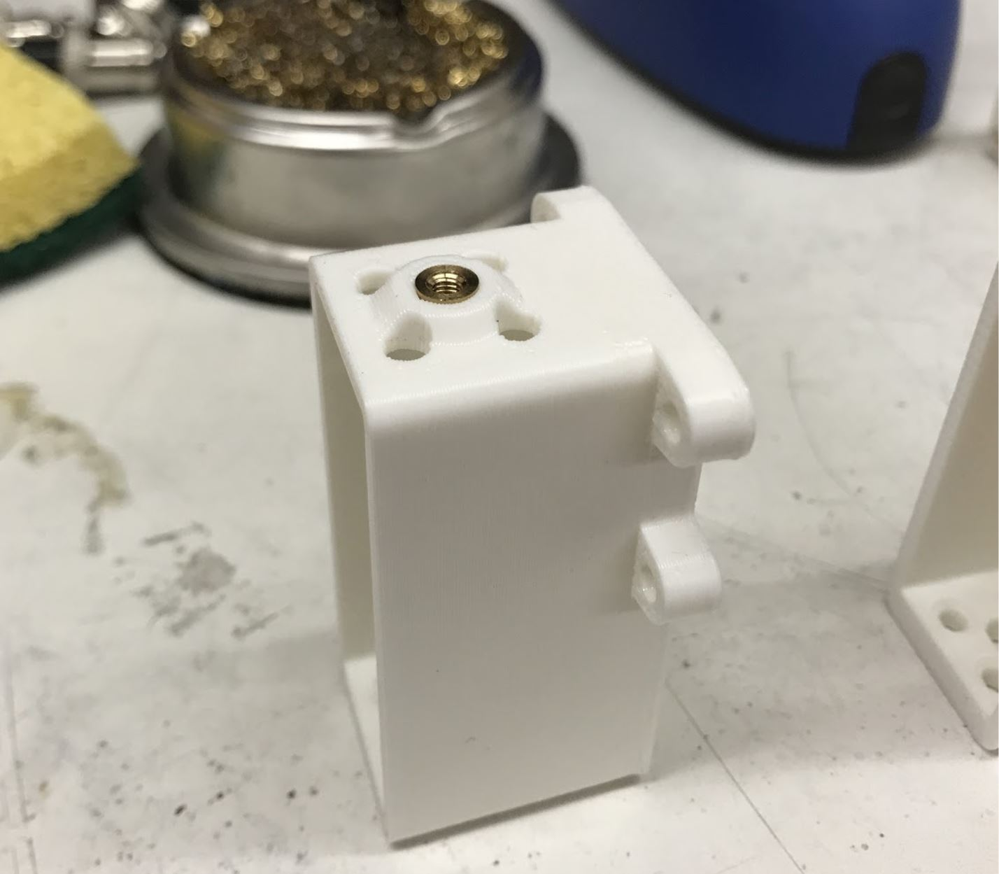

Step 3. Mount disc to inner hip part
^^^^^^^^^^^^^^^^^^^^^^^^^^^^^^^^^^^^^

* Video Instructions: https://youtu.be/qUoLoNEeEI8
*  Materials: M3x8 flat head screw,  Inner hip part, loctite
*   Tools: 2mm hex driver

Instructions: 

1. Install the inner hip part at a 90deg angle and then use the access holes on the other side to tighten down the M3x8 flat head screw attaching it to the servo disc.

Preparing for the assembly

.. image:: ../_static/hip3pre.jpg
    :align: center

Completed step for left side

.. image:: ../_static/hip3left.jpg
    :align: center

Completed step for right side

.. image:: ../_static/hip3right.jpg
    :align: center

Step 4. Install the inner hip servo
^^^^^^^^^^^^^^^^^^^^^^^^^^^^^^^^^^^^^

* Video Instructions: https://youtu.be/6Rd2ZSjpYhM
*  Materials: Inner Hip Assembly so far, servo, M4x10mm screws for plastic (silver), M3x16mm button head, 2x standoff
*   Tools: T20H torx driver, 2mm hex driver

Instructions: 

1. Place servo motor in the inner hip part and gently wiggle such that the servo shaft is sticking out of the big circular hole in the inner hip part
2. Screw the M4x10mm screws on the left side of the servo and the M3x16mm screws on the right side of the motor. Use locktite on M3x16mm screws
3. Turn over assembly and screw M3x16mm screws onto standoffs

Preparing for the assembly

.. image:: ../_static/hip4pre.jpg
    :align: center
	
Completed step 

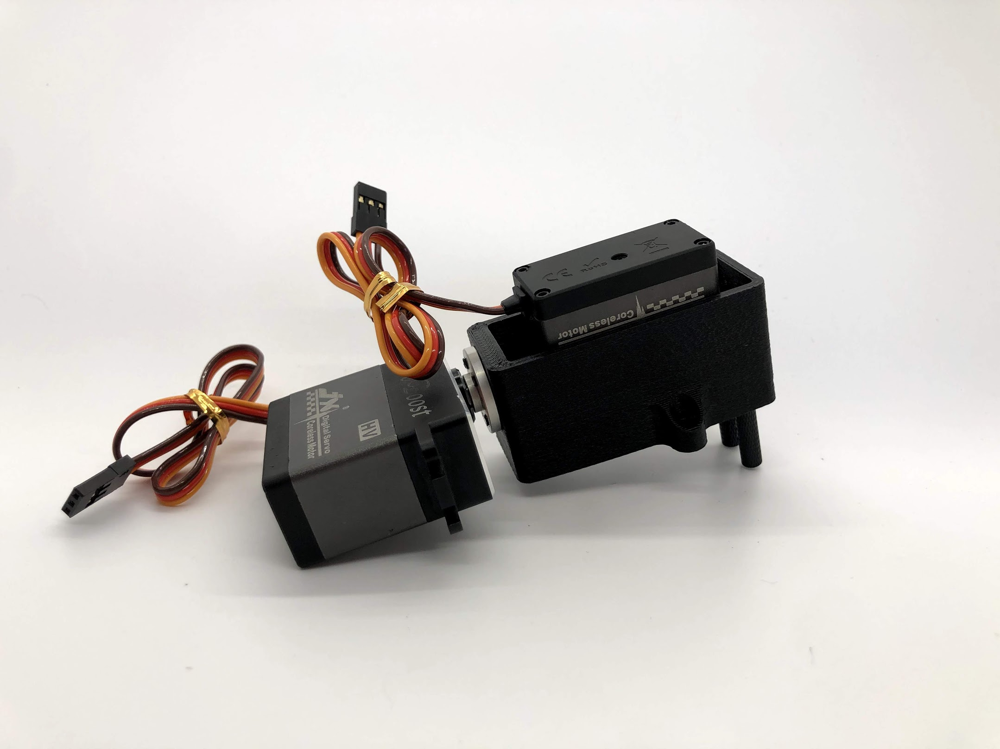

Another look at the assembly. Note that the plastic screws are on the left, and the M3 screws are on the right

.. image:: ../_static/hip4coman.jpg
    :align: center

Step 5. Install servo horn on inner hip servo
^^^^^^^^^^^^^^^^^^^^^^^^^^^^^^^^^^^^^^^^^^^^^^^

* Video Instructions: https://youtu.be/wqRM8rbfDBM
*  Materials: Inner Hip Assembly so far, M3x8mm button head screw, M2x8mm socket head screw, servo horn
*   Tools: 2mm hex driver

Instructions:

1. Turn the servo into its neutral position and then slide the horn on at the angle shown (45 degrees downwards)
2. Screw the M3x8mm screw on to the top of the horn and screw the M2x8mm screws into the side of the horn
3. Don’t forget to use loctite!

Preparing for the assembly

.. image:: ../_static/hip5pre.jpg
    :align: center

Completed step for right side

.. image:: ../_static/hip5com.jpg
    :align: center

Completed step for left side

Step 6. Attach Leg 
^^^^^^^^^^^^^^^^^^^^^

* Video Instructions: https://youtu.be/bMr0gCNQJxM
*  Materials: Bottom Leg, Top Leg, 3-part Thrust Bearing x2, Shoulder Bolt, M3 Lock Nut   
*   Tools: 2mm driver, wrench for lock nut 

Instructions: 

1. Add one 3-part thrust bearing on the shoulder bolt, then the Bottom leg, then another 3-part thrust bearing, then the Top leg then locking nut. Flip orientation of Bottom and Top leg accordingly for the left and right leg. See pictures for reference.
 
Preparing for the right assembly

.. image:: ../_static/hip6preright.jpg
    :align: center

Preparing for the left assembly

.. image:: ../_static/hip6preleft.jpg
    :align: center

Step 7. Attach top carbon leg link to servo horn 
^^^^^^^^^^^^^^^^^^^^^^^^^^^^^^^^^^^^^^^^^^^^^^^^^

* Video Instructions: https://youtu.be/Tp3HsjZY7qY
*  Materials: Inner Hip Assembly, Leg Assembly, M3x6 Button Head x2. 
*   Tools: 2mm hex driver

Instructions: 

1. Align the curved edge of the left Top leg with the left Servo horn. Screw in the M3x6 button head screws through the carbon leg holes. Repeat for right side.
2. Be careful when seating the screw nearest to the servo to ensure it is vertical. It is necessary to hold the screw vertically to avoid cross threading. 

Preparing for the assembly

.. image:: ../_static/hip7pre.jpg
    :align: center

Completed step for right side

.. image:: ../_static/hip7com.jpg
    :align: center

Step 8. Install outer hip assembly
^^^^^^^^^^^^^^^^^^^^^^^^^^^^^^^^^^^

* Video Instructions: https://youtu.be/iIqjgKaIPs8
*  Materials: Servo, outer hip part, M4x10mm screw plastic
*   Tools: T20H torx driver

Instructions: 

1. Place servo into joint and add affix with two screws closest to the servo spline

Preparing for the assembly

.. image:: ../_static/hip8pre.jpg
    :align: center

Completed step

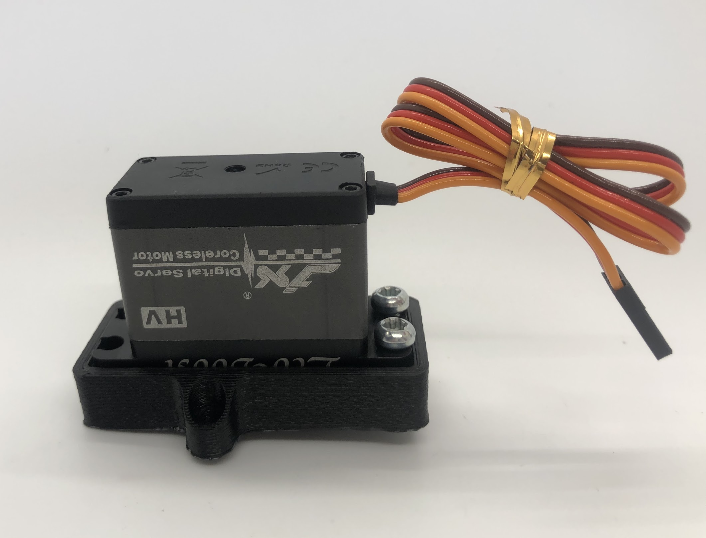

Step 9. Install servo horn on outside servo
^^^^^^^^^^^^^^^^^^^^^^^^^^^^^^^^^^^^^^^^^^^^

* Video Instructions: https://youtu.be/Tj7zx2M6xas
*  Materials: Servo horn, Outer Hip assembly, M3x8 button head, M2x8 socket head
*   Tools: 2mm hex driver

Instructions: 

1. Turn the servo horn to its neutral position and then attach the horn at a 45 degree angle as shown.
2. First tighten the servo horn down with the M3x8, then add the M2x8 screws to tension the servo horn. Similar to Step 5. 

Preparing for the assembly

.. image:: ../_static/hip9pre.jpg
    :align: center

Completed step for right side

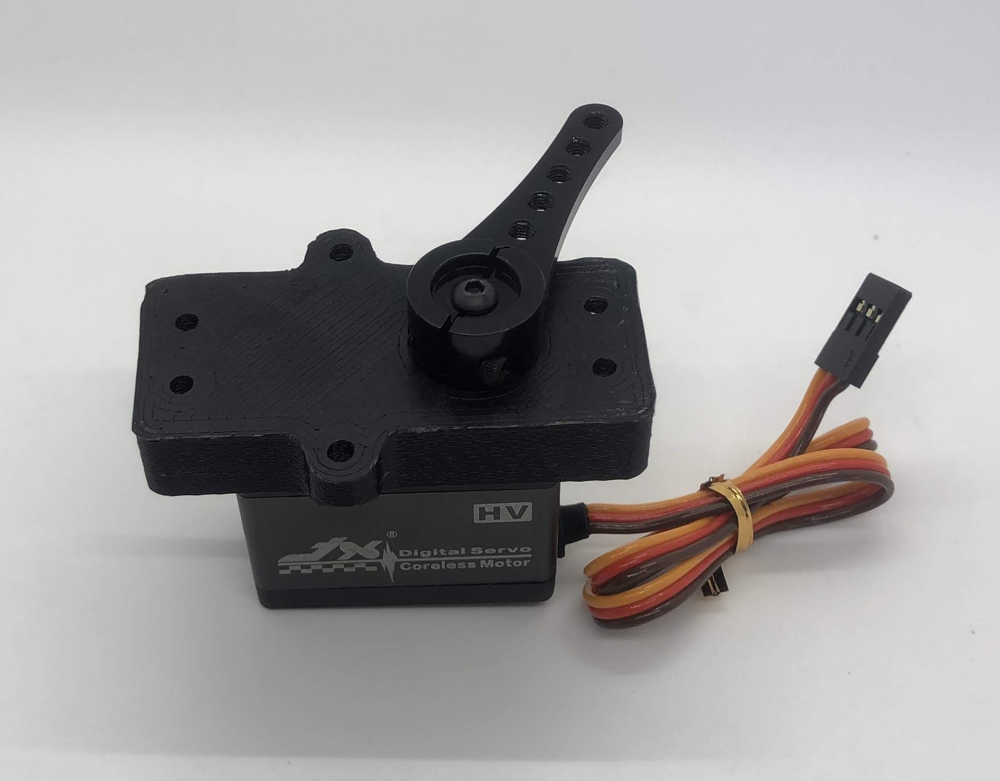

Completed step for left side

.. image:: ../_static/hip9comleft.jpg
    :align: center

Step 10. Assemble the two sides
^^^^^^^^^^^^^^^^^^^^^^^^^^^^^^^^^

* Video Instructions: https://youtu.be/dKv7VrdE290
*  Materials: Inner and Outer Hip assembly, M3x16 button head screws for screwing into standoffs, loctite
*   Tools: 2mm hex driver

Instructions: 

1. Align Inner and Outer Hip assembly, M4x10mm plastic screws should be on the same side and servo horns should be at a 90degree angle. 
2. Connect assemblies with M3x16 screws through Outer Hip assembly to standoffs. Add loctite on screws. Don’t tighten the screws down all the way yet. 
3. At this point, your legs might start to move, feel free to mark your left and right side so you don’t get confused. If you don’t know which side is which, compare with the 3D model: https://stanford195.autodesk360.com/g/shares/SH919a0QTf3c32634dcfedf61e031f673710

Preparing for the assembly

.. image:: ../_static/hip10pre.jpg
    :align: center

Completed step

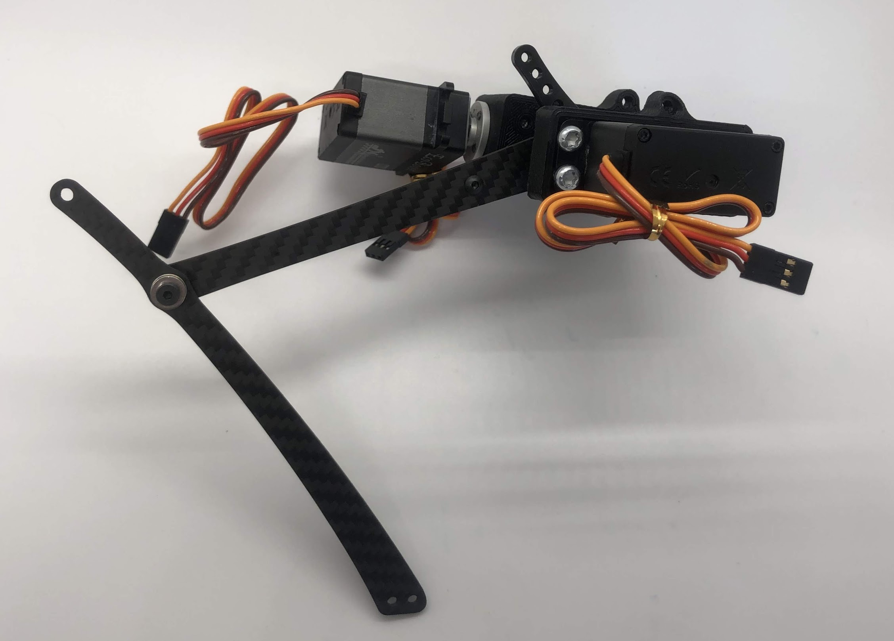

Another look at the assembly

.. image:: ../_static/hip10coman.jpg
    :align: center

Step 11. Assemble the other 2 standoffs
^^^^^^^^^^^^^^^^^^^^^^^^^^^^^^^^^^^^^^^^

* Video Instructions: https://youtu.be/nD_yWAIB70c
*  Materials: Assembly, 4 M3x10 button head screws, 2 standoffs
*   Tools: 2mm hex driver

Instructions:

1. Install the other 2 standoffs and fasten with M3x10 button head screws 

Preparing for the assembly

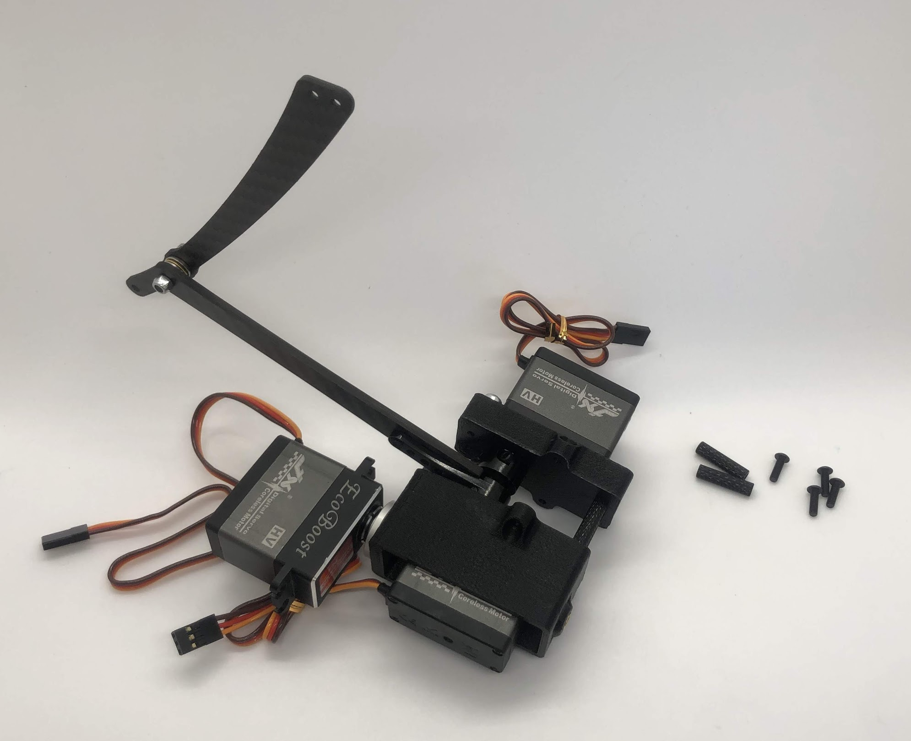

Completed step 

.. image:: ../_static/hip11com.jpg
    :align: center

Step 12. Test the full range of motion for each servo 
^^^^^^^^^^^^^^^^^^^^^^^^^^^^^^^^^^^^^^^^^^^^^^^^^^^^^^

* Video Instructions: https://youtu.be/gvaUp9pQ-W4

Instructions: 

1. Hip should go the fully flat on either side
2. The horn nearest the body should go from 45 degrees upward to fully touching the lower standoff
3. The horn away from the body should go from touching the standoff upwards to going 45 degrees downward 

Step 13. Assemble the upper leg extension rod
^^^^^^^^^^^^^^^^^^^^^^^^^^^^^^^^^^^^^^^^^^^^^^

* Video Instructions: https://youtu.be/4e2r8jGPv5Q
*  Materials: Threaded rod, rod end x 2
*   Tools: None

Instructions: 

1. Screw the rod ends on equally until the distance between the furthest holes on the rod match the holes on the upper carbon leg linkage (servo horn center to last carbon drill point). See picture for clarification. 

Preparing for the assembly

.. image:: ../_static/hip13pre.jpg
    :align: center

Completed step

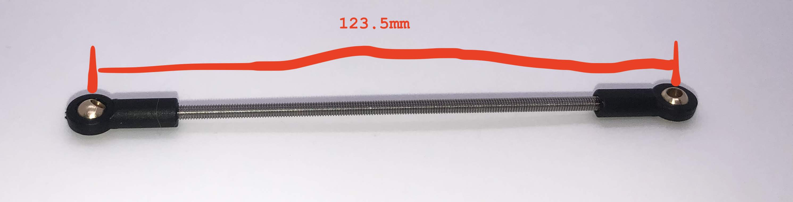

Step 14. Attach Upper Leg Extension Rod to Servo Horn
^^^^^^^^^^^^^^^^^^^^^^^^^^^^^^^^^^^^^^^^^^^^^^^^^^^^^^^^

* Video Instructions: https://youtu.be/c0DC35XpYTk
*  Materials: M3x8 button head screw
*   Tools: 2mm driver

Instructions: 

1. From the inside, screw the extension rod to the servo horn with the M3x8 button head screw.

Preparing for the assembly

.. image:: ../_static/hip14pre.jpg
    :align: center

Step 15. Attach Upper Leg Extension Rod to Lower Leg Carbon Linkage 
^^^^^^^^^^^^^^^^^^^^^^^^^^^^^^^^^^^^^^^^^^^^^^^^^^^^^^^^^^^^^^^^^^^^^^

* Video Instructions: https://youtu.be/uQt9EFQzu2w
*  Materials: M3x10 button head screw, M3 Locking Nut
*   Tools: 2mm driver, wrench

Instructions: 

1. Slide a M3x10 button head screw through the carbon fiber piece and then the rod end. Then fasten the screw with a M3 locknut, using a wrench to keep it in place while you use an allen key to tighten.

Preparing for the assembly

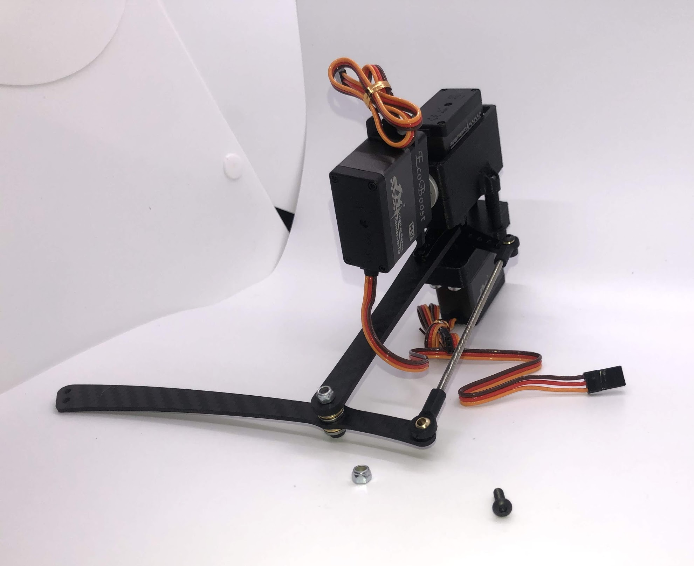

Completed step

.. image:: ../_static/hip15com.jpg
    :align: center
	
Another look at the assembly

.. image:: ../_static/hip15coman.jpg
    :align: center

Done!
^^^^^^

Left and Right side

.. image:: ../_static/hip16.jpg
    :align: center

.. image:: ../_static/hip16an.jpg
    :align: center

Continue on to Body Assembly

Body Assembly
--------------

Step 1. Install tapered threaded heat inserts into 3D printed parts
^^^^^^^^^^^^^^^^^^^^^^^^^^^^^^^^^^^^^^^^^^^^^^^^^^^^^^^^^^^^^^^^^^^^

* No Video Available  
*  Materials: M3 tapered heat-set inserts for plastic x16, 4 body pieces
*   Tools: Soldering iron set to around 500f / 260c

Instructions: 

1. Each of the 3D printed body pieces have four holes — two on top and two on bottom that hold the tapered heat-set inserts for plastic
2. Place the insert into the hole with the tapered side down
3. Use a soldering iron set to around 500f or 260c to gently press the insert into the plastic. I recommend just using the weight of the iron to press the insert in, and I also suggest doing it in steps, ie pressing it in 1mm, taking the iron out, then pressing another 1mm etc into it is all the way in. This method prevents the soldering iron from getting stuck to the iron.
  
Before pressing the tapered threaded heat insert

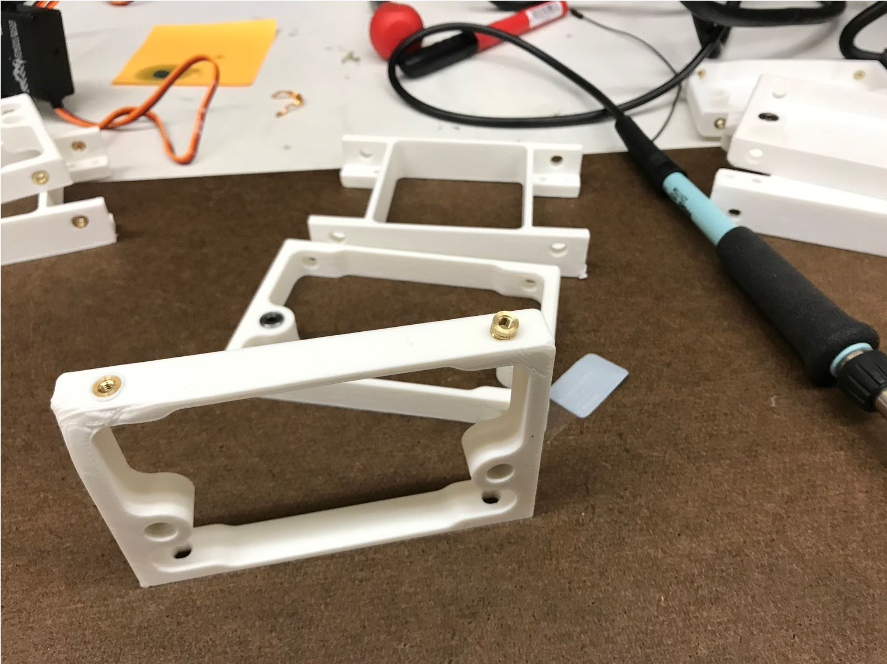

After pressing the tapered threaded heat insert

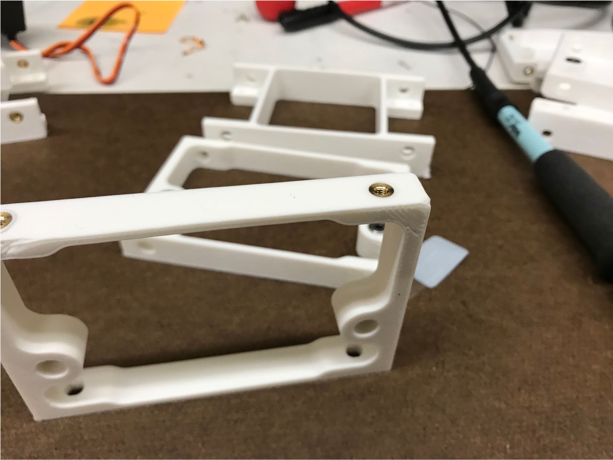

Step 2: Press the radial bearings into the body pieces
^^^^^^^^^^^^^^^^^^^^^^^^^^^^^^^^^^^^^^^^^^^^^^^^^^^^^^^

* No Video Available
*  Materials: 4 bearings (3mm x 8mm x 4mm Bearing MR693-zz), Front Front body part, Back Front body part
*   Tools: Your hands, arbor press, or vice

Instructions: 

1. Press two bearings into the two holes in the frontmost piece (called Front Front), and two bearings into the two holes in the back piece (called Back Front). 

Preparing for the assembly

.. image:: ../_static/body2pre.jpg
    :align: center

Completed Step

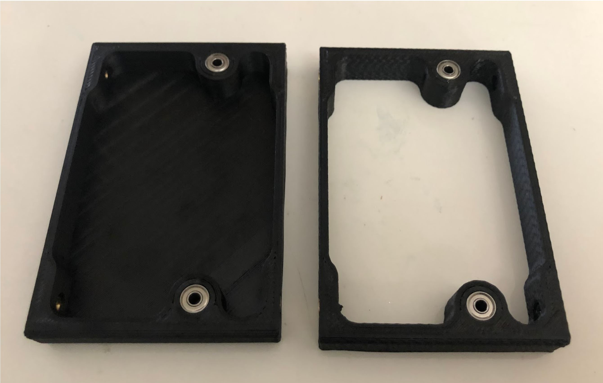

Step 3. Fasten the hip assemblies
^^^^^^^^^^^^^^^^^^^^^^^^^^^^^^^^^^

* Video Instructions: https://youtu.be/Av9e2HzpbBo
*  Materials: 16x M4x8 screws (plastic), 4x M3x8 button head screw, four hip assemblies, four body parts
*   Tools: Torx T20 + 2mm driver

Instructions: 

1. Use the M4x8 screws for plastic to fasten two hip assemblies to the Back Back body part and another two hip assemblies to the Front Back body part
2. Then screw the M3x8 button head screws through the bearings you pressed into the Front Front and Back Front parts and thread them into the threaded inserts in the hip assembly

Preparing for the assembly

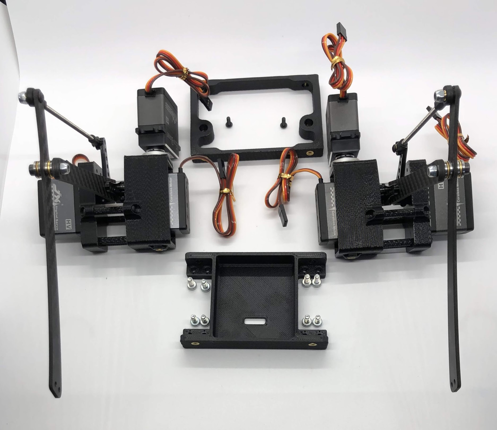
	
Completed Step

.. image:: ../_static/body3com.jpg
    :align: center

Another look at the assembly

.. image:: ../_static/body3coman.jpg
    :align: center

Hi Michael & Toast
^^^^^^^^^^^^^^^^^^
(Yes, the back legs are the same as the front. Sorry, our documentation is still a work in progress.)

Step 4. Attach the two leg/body assemblies to the bottom carbon fiber plate
^^^^^^^^^^^^^^^^^^^^^^^^^^^^^^^^^^^^^^^^^^^^^^^^^^^^^^^^^^^^^^^^^^^^^^^^^^^^

* Video Instructions: https://youtu.be/f4iDKkfCkIs
*  Materials: 16x M3x6 button head screws, 2 leg/body assemblies, Botton carbon fiber plate
*   Tools: 2mm hex driver 

Instructions: 

1. Use the M3x6 button head screws to fasten the two leg/body assemblies you built to the bottom carbon fiber plate.

Preparing for the assembly

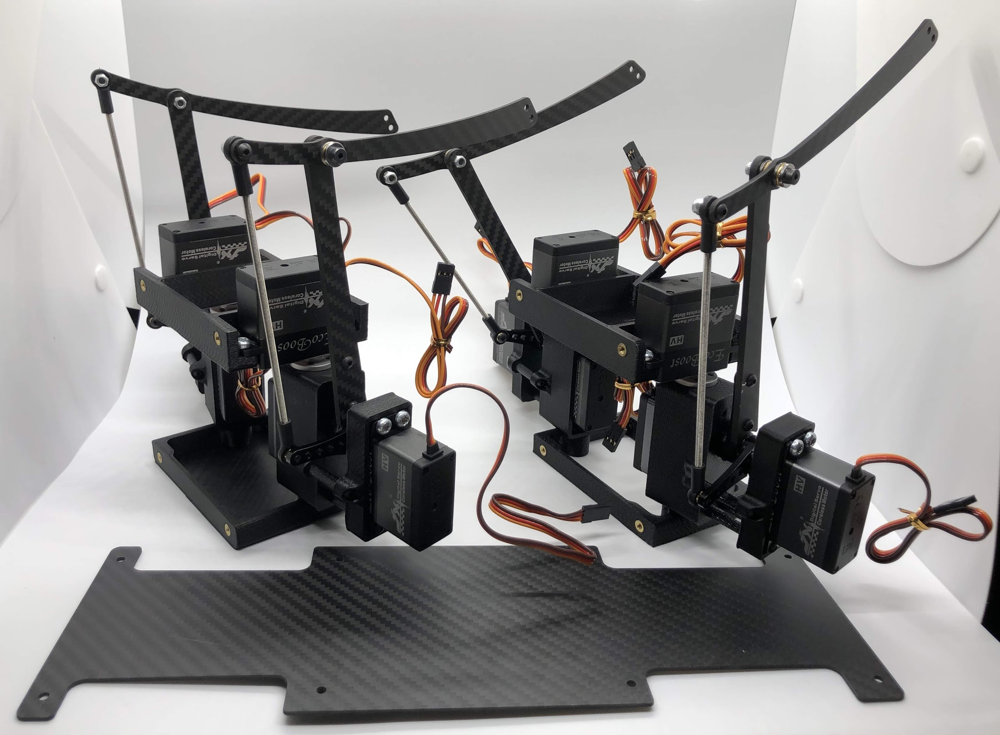
	
Completed step

.. image:: ../_static/body4com.jpg
    :align: center

Step 5. Prepare and mount the Raspberry Pi case
^^^^^^^^^^^^^^^^^^^^^^^^^^^^^^^^^^^^^^^^^^^^^^^^

* Video Instructions: https://youtu.be/ZlbkTc2Jxu8
*  Materials: Raspberry Pi case (picase.stl), 4x M2.5 tapered heat-set inserts, 4x M2.5x6 socket head screws, Dual Lock
*   Tools: Soldering iron, 2mm driver

Instructions:  

1. In the same way you installed the previous inserts, press the M2.5 inserts into the holes in the raspberry pi case. Then, use the M2.5x6 socket head screws to screw the raspberry pi to the case
2. Finally, add Dual-Lock to the case to mount it to the bottom carbon fiber plate

.. Preparing to insert the M2.5 insert into the Raspberry Pi case.
.. All four inserts pressed into the case.

Preparing for the assembly 

.. image:: ../_static/body5pre.jpg
    :align: center

Completed Step

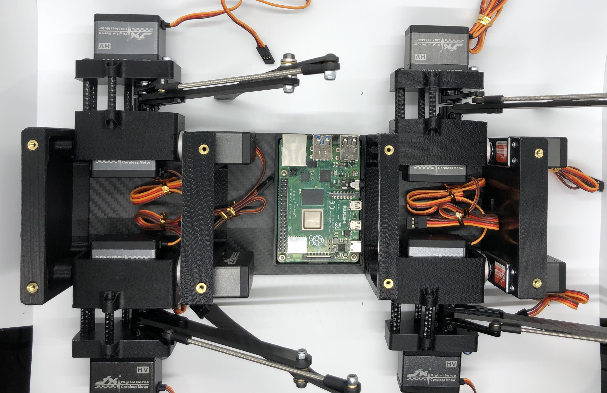

Step 6. Assemble the PCB (if not done so already)
^^^^^^^^^^^^^^^^^^^^^^^^^^^^^^^^^^^^^^^^^^^^^^^^^^

Navigate to PCB Assembly Instructions

Step 7. Plug in servo motors to Raspberry Pi
^^^^^^^^^^^^^^^^^^^^^^^^^^^^^^^^^^^^^^^^^^^^^

* Video Instructions: https://youtu.be/ToJtlmDO4AY
*  Materials: Four hip assemblies mounted to the bottom plate, mounted Raspberry Pi with servo power distribution hat
*   Tools: None

Instructions:

1. Connect PCB to Rasberry Pi  
2. Plug the servo cables into the custom circuit board in this pattern shown below. 

J1 through J12 correspond to one of the twelve sets of header pins soldered to the circuit board. The circuit board has indicators for how to align the signal, ground, and positive wires from the servo motors into the board, but in case they’re too hard to see, you can know that the signal pins on the servo connectors always face towards the Raspberry Pi header.

Preparing for the assembly

.. image:: ../_static/body7pre.jpg
    :align: center
	
Completed step

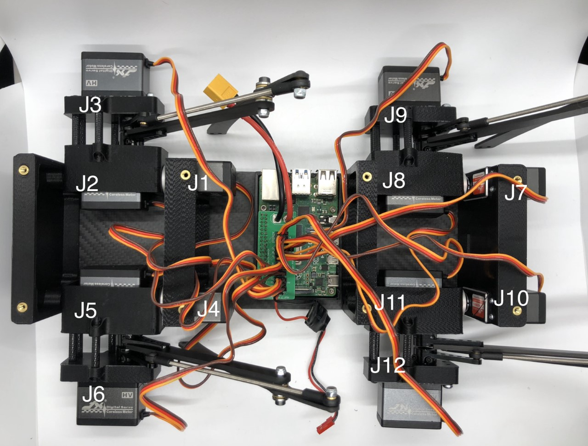

Done!
^^^^^^

Complete PCB assembly if you haven’t done so already.
	
PCB Assembly 
--------------

Step 1: Solder the servo connector headers to the board
^^^^^^^^^^^^^^^^^^^^^^^^^^^^^^^^^^^^^^^^^^^^^^^^^^^^^^^^^

* No Video Available
*  Materials: PCB, 12 male headers of 3 pins each
*   Tools: Soldering iron, preferably a nice one with >=60W heat output.

Instructions:

1. Place each of the 12 male header pins into their respective slots as shown in the photo. 
2. Then, turn the board upside down so you have access to solder the underside. Be careful that the headers don’t all fall out when you turn the board over. When I did this, I pressed a hard foam block up against the top side of the pins to make sure they didn't tilt or fall out when I turned the board over. You’ll also want to check that the pins are mostly perpendicular to the board after you turn the board over.  
3. Once the board is turned over, solder all of the signal pins to keep the headers in place. The signal pins are the pins closest to the Raspberry Pi header pin holes (the 2x20 array). 
4. Once the headers are all tacked into place, solder the remaining ground and positive pins.

Placed all the pins into the board unsoldered

.. image:: ../_static/pcb1pre.jpg
    :align: center
	
Completed Step, soldered pins

.. image:: ../_static/pcb1pre.jpg
    :align: center
	
Step 2: Solder the Raspberry Pi header pin
^^^^^^^^^^^^^^^^^^^^^^^^^^^^^^^^^^^^^^^^^^^^^

* No Video Available
*  Materials: PCB, 2x20 raspberry pi header pin
*   Tools: Soldering iron

Instructions:

1. Insert the 2x20 header pin into the PCB. Make sure that you insert the header from the bottom so that the pins are coming out the top. This will allow the header to sit on top of the Raspberry Pi.
2. Secure the PCB and header pin in a vice
3. Solder the header pins in from the top.

After soldering the 2x20 header pin onto the PCB.

.. image:: ../_static/pcb2.jpg
    :align: center

Underside of board after soldering the 2x20 header pin.

.. image:: ../_static/pcb2an.jpg
    :align: center

Step 3: Solder the bec and 5V in pins
^^^^^^^^^^^^^^^^^^^^^^^^^^^^^^^^^^^^^^^

* No Video Available
*  Materials: PCB, header pins
*   Tools: Soldering iron, vice

Instructions: 

1. Snap off a pair of 1x2 header pins and solder them to the areas labelled Vbat and Regulated 5V. Important: If you do not have a dupont/jst crimps and crimper on hand, then do not solder pins to the Vbat holes.

BEC and 5V pins (four pins on the right) soldered to the PCB.

.. image:: ../_static/pcb3.jpg
    :align: center

Step 4: Solder the XT 60 pigtail connector to the PCB
^^^^^^^^^^^^^^^^^^^^^^^^^^^^^^^^^^^^^^^^^^^^^^^^^^^^^^^^^

* No Video Available
*  Materials: PCB, XT60 pigtail connector
*   Tools: Soldering iron, vice

Instructions:

1. Insert the xt 60 pigtail from the top and solder from the bottom. Make sure you get the polarity correct! The PCB has little labels for the + and - wires of the xt 60 pigtail.

Male XT60 Pigtail (Female housing, male pins)

.. image:: ../_static/pcb4pre.jpg
    :align: center

After soldering on the XT60 pigtail.

.. image:: ../_static/pcb4com.jpg
    :align: center

Another view of XT60 solder connection.

.. image:: ../_static/pcb4coman.jpg
    :align: center
	
Step 5: Test the power distribution board for shorts
^^^^^^^^^^^^^^^^^^^^^^^^^^^^^^^^^^^^^^^^^^^^^^^^^^^^^

* No Video Available
*  Materials: PCB
*   Tools: Multimeter

Instructions: 

1. Inspect the board visually to make sure no solder blobs are shorting together
2. Turn the multimeter to the short detecting setting. This is usually indicated by a little speaker icon. 
3. Test that the + and - pins of the xt 60 connector do not short together
4. Test that none of the signal wires short to + or - either. 
5. Test that none of the signal wires short to each other.

Step 6: Test for servo power
^^^^^^^^^^^^^^^^^^^^^^^^^^^^^^

* No Video Available
*  Materials: PCB, servos
*   Tools: none

Instructions: 

1. Plug in your 2S lipo (never plug in anything more than 8.4V or it’s very likely you’ll burn out your servos)
2. Connect in a single servo into the board, noting the labels for the signal, -, and + wires. On servos, the signal wire is usually yellow or white. 
3. Reference picture to determine correct wire orientation. 
4. If the servo doesn’t start smoking when you plug it in, good job!
5. Unplug the servo and battery for now.

.. image:: ../_static/pcb6.jpg
    :align: center

Step 7: Plug in the 5V voltage regulator
^^^^^^^^^^^^^^^^^^^^^^^^^^^^^^^^^^^^^^^^^^^^

* No Video Available
*  Materials: PCB, 5V regulator (BEC)
*   Tools: Soldering iron or crimper

Instructions: 

1. We use a 5V BEC to reduce the 7.4-8.4V voltage from the battery to 5V for the Raspberry Pi. The 5V output of the BEC has a JST connector which mates nicely with the Regulated 5V in pins you soldered in step 4. 
2. The input side of the BEC has a male JST connector which you should now snip off. 
3. You can either strip these input wires and solder them to the Vbat holes directly, or you can crimp female dupont headers to the wires, put them in a 1x2 housing, and plug the wires into the Vbat pins.

Done!
^^^^^^

Complete hip assembly and body assembly if you haven’t done so already.

