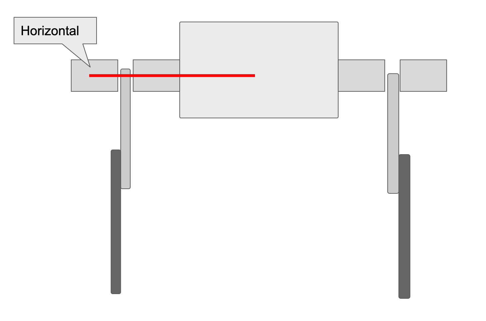
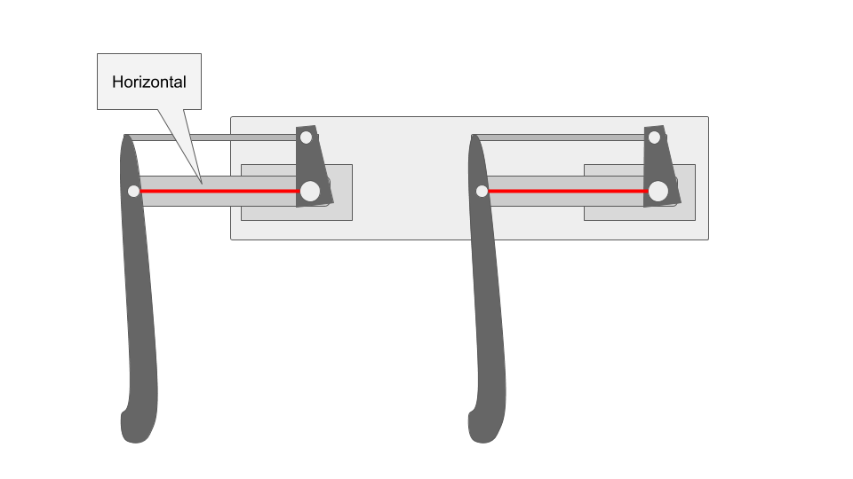
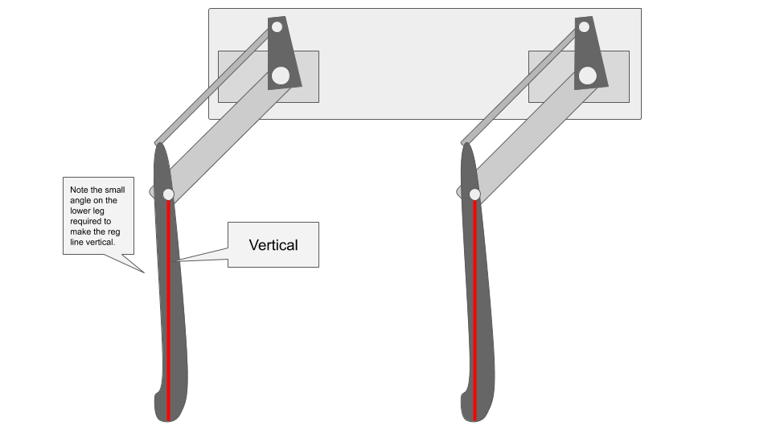

==============
Calibration
==============

Calibration is a necessary step before running the robot because that we don't yet have a precise measurement of how the servos arms are fixed relative to the servo output shafts. Running the calibration script will help you determine this rotational offset by prompting you to align each of the 12 degrees of freedom with a known angle, such as the horizontal or the vertical. 

Materials
-----------
#. Finished robot
#. Some sort of stand to hold the robot up so that its legs can extend without touching the ground/table. 

Steps
------
#. MangDang produced a `video <https://youtu.be/4bmYi6F7OBs>`_ illustrating the calibration steps outlined below. You can stop watching at 17:00 because the new code automatically writes the calibration numbers rather than requiring you to edit the calibration file manually.
#. Plug in your 2S Lipo battery
#. SSH into the robot as done in the installation section
#. Stop the robot script from taking over the PWM outputs::
    
    rw
    sudo systemctl stop robot
    
#. Run the calibration script

    * The calibration script will prompt you through calibrating each of pupper's 12 servo motors. When it asks you to move a link to the horizontal position, you might be wondering what exactly counts as making the link horizontal. The answer is to align the *joint centers* of each link. For example, when aligning the upper link to the horizontal, you'll want to the line between the servo spline and bolt that connects the upper link to the lower link to be as horizontal as possible.::
        
        cd StanfordQudruped
        sudo pigpiod
        python3 calibrate_servos.py

    * The images below illustate the horizontal and vertical positions mentioned in the calibration script.
    * If your servos can't reach these positions, it's likely the servo discs and/or arms were assembled incorrectly.

Correct alignment for the ab/adduction motors:

Correct alignment for the upper link:

Correct alignment for the lower link:

#. Re-enable the robot script::
    
    sudo systemctl start robot
