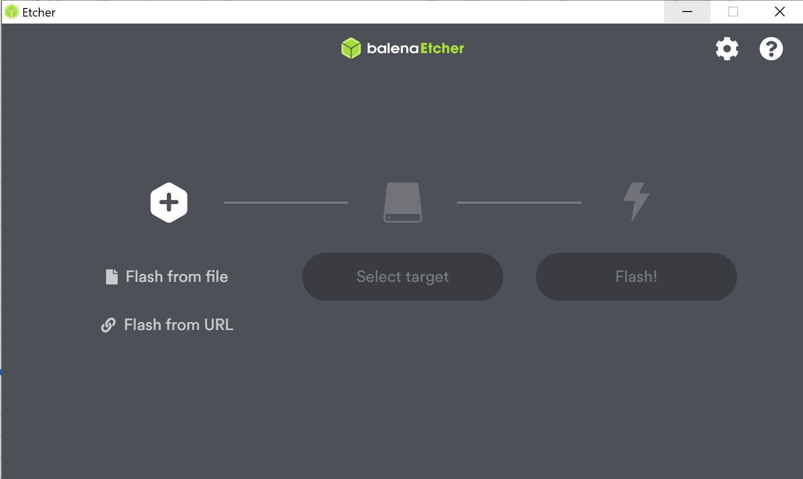
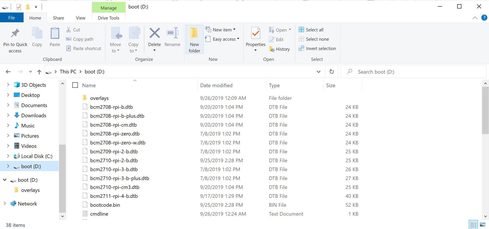
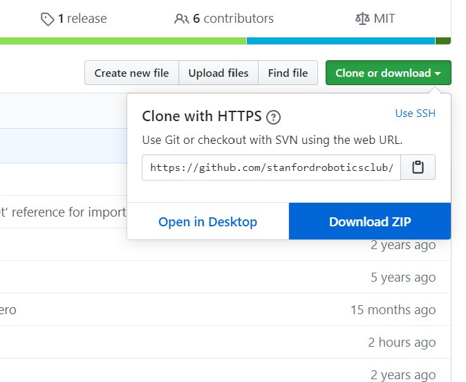
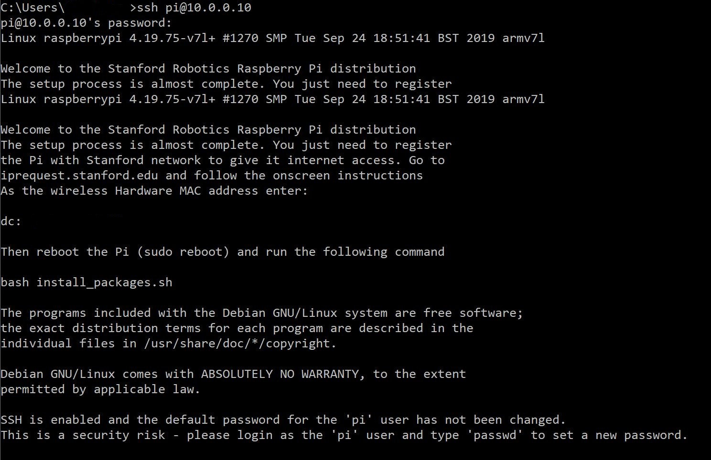
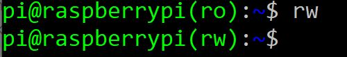
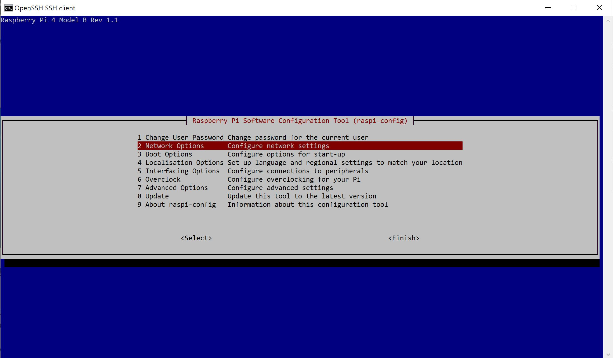
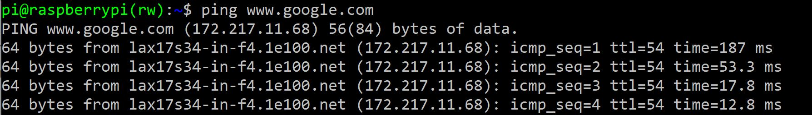

=====================
Software Installation
=====================

.. contents:: :depth: 4

Setting up your Raspberry Pi
------------------------------

* Raspberry Pi 4
*  SD Card (32GB recommended)
*   Raspberry Pi 4 power supply (USB-C, 5V, >=3A)
*    Ethernet cable

Preparing the Pi's SD card
^^^^^^^^^^^^^^^^^^^^^^^^^^^^^^^^^

From your desktop / laptop:

1. Put the SD card into your desktop / laptop. 
###############################################

2. Download this version of Raspbian
#################################################################

Use `this version <https://slack-files.com/T0RAWRCGY-FQG7WTSBH-eb9549ed22>`_ so everyone is using the same version. Unzip and extract the file. 

3. Use `etcher <https://www.balena.io/etcher/>`_ to flash the card. 
##########################################################################################

* If you are using the recommended etcher, this is the start-up menu. Select 2019-09-26-raspbian-buster-lite.img (file inside zip )and the SD card. 

*  Image of SD card being flashed. 

.. image:: ../_static/flash2.JPG
    :align: center

*   Done!

4. Open up the SD card file system.
###################################################################

Sometimes it takes some time for your computer to read the SD card and show the boot folder. Try removing the SD card and putting it back in, if the problem persists. 

5. Download the latest release of the `RPI-Setup repository <https://github.com/stanfordroboticsclub/RPI-Setup>`_. 
#####################################################################################################################

* Unzip and extract all the files. 

	
6. Move all the files in the downloaded repository into the SD card. 
#####################################################################

* Replace any files that conflict so the repository's version overwrites the original version. You can now delete the zip file and the now empty folder.  

.. image:: ../_static/replaceboot.jpg
    :align: center

7. Turn on your Raspberry Pi. 
###################################################################################################
Remove SD card from computer and put it into your Raspberry Pi. Connect power to the Pi as well. 

8. Configure your computer to SSH into the robot
######################################################## 

* To use ethernet for set up (recommended), connect the ethernet cable to your computer and the raspberry pi. 
* Go to your network settings for the interface you wish to use (ethernet/wifi)
* Change your Configure IPv4: Manually
* Change your IP Address to something in range 10.0.0.X (If you are a part of Stanford Student Robotics pick something that doesn't colide with other systems from this `document <https://docs.google.com/spreadsheets/u/1/d/1pqduUwYa1_sWiObJDrvCCz4Al3pl588ytE4u-Dwa6Pw/edit?usp=sharing>`_ )
* Change your Subnet Mask: 255.255.255.0
* Leave the Router blank
* After disconnecting from the robot network remember to return those settings to what they orignially were, otherwise your internet on that interface won't work

9. SSH into the pi from your computer.
######################################

Run ``ssh pi@10.0.0.10`` (The default password is ``raspberry``)

10. Enter read-write mode
####################################################################################################
Run ``rw`` in the robot shell.
Confirm that the terminal prompt ends with (rw) instead of (ro).

11. Install prerequisites
##############################

* Run ``sudo ./install_packages.sh``
* If the IP is still 10.0.0.10 you will be prompted to change it. The raspberry Pi IP should not conflict with your computer's IP, 10.0.0.Y. 
* If the hostname is still raspberry you will be prompted to change it.  
* You will be asked to enter the current time and date. This is needed so that certificates don't get marked as expired. There is a ``time_sync.sh`` script that updates the current time from google

Getting internet access at Stanford
^^^^^^^^^^^^^^^^^^^^^^^^^^^^^^^^^^^^^
This script will make so the RPi automatically wants to connect the Stanford network. Initially it won't be able to do that as it is not yet authenticated to do it. To set that up:

* Plug your Pi in to power (over the onboard micro USB port). Either plug a monitor and keyboard into the Pi or SSH into it using your laptop over Ethernet. Log in to the Pi. In the welcome message that comes after the login line, look for the Pi's MAC address, which will appear under the line that says "wireless Hardware MAC address". Note that address down.
*  Use another computer to navigate to iprequest.stanford.edu.
*   Log in using your Stanford credentials.
*    Follow the on-screen instructions to add another device:

     * **First page:** Device Type: Other, Operating System: Linux, Hardware Address: put Pi's MAC address
     *  **Second page:** Make and model: Other PC, Hardware Addresses Wired: delete what's there, Hardware Addresses Wireless: put Pi's MAC address

*     Confirm that the Pi is connected to the network:

      * Wait for an email (to your Stanford email) that the device has been accepted
      *  **sudo reboot** on the Pi
      *   After it's done rebooting, type ping www.google.com and make sure you are receiving packets over the network

Getting internet access elsewhere
^^^^^^^^^^^^^^^^^^^^^^^^^^^^^^^^^^^^^

There are two methods for getting internet access elsewhere: using the raspi-config tool on the Pi or changing the wpa_supplicant file in the SD card file system. Using the raspi-config tool is simpler and recommended for beginners, but the benefits of modifying the wpa_supplicant file is that you can set the proper internet settings before starting up the Pi, which may help in scenarios where you'd like to do as little setup on the Pi as possible.

1. Raspi-config method

Once SSH'd into the Pi, run:

::

	sudo raspi-config

This is the menu that will appear. Go to Network Options, then Wi-Fi and enter your SSID (Wi-Fi name, eg. Netgear, Linksys) and password. 

.. image:: ../_static/raspconfig2.JPG
    :align: center

2. Wpa_supplicant method

Edit **/etc/wpa_supplicant/wpa_supplicant.conf** as documented in `this link <https://www.raspberrypi.org/documentation/configuration/wireless/wireless-cli.md>`_ , see "Adding the network details to the Raspberry Pi". You can also see this `link <https://linux.die.net/man/5/wpa_supplicant.conf>`_. Thanks to pi-init2 magic that file can be edited before the pi is ever turned on from **/boot/appliance/etc/wpa_supplicant/wpa_supplicant.conf**

What the RPI-Setup repo does
^^^^^^^^^^^^^^^^^^^^^^^^^^^^

* Enables ssh. Because the password is kept unchanged (raspberry) ssh is only enabled on the ethernet interface. Comment out the ListenAddress lines from /boot/appliance/etc/ssh/sshd_config to enable it on all interfaces.
*  Sets the Pi to connect to the robot network (10.0.0.X) over ethernet
*   Expands the SD card file system
*    Sets the file system up as read-only
*     Prepares to connect to Stanford WiFi (see above for details)
*      Gives the script to install tools and repos needed for development

Installing the StanfordQuadruped software on the Raspberry Pi
-------------------------------------------------------------

Steps
^^^^^^^

1. Connect to the Pi over SSH 
##############################

Check that it has access to the internet. If you're having trouble SSH-ing into the Pi, please check the instructions for setting the Pi's ethernet settings linked in the previous step.

::

	ssh pi@10.0.0.Y
	
	* Here, "Y" is the IP address you chose for the Pi when running the install_packages.sh script. When prompted for the password, enter the default password "raspberry" or the one you set in the install_packages.sh script.

2. Test for the internet connection. 
######################################

It should only run 4 tests, if it continues, use Ctrl + C to stop it. Below is a piture of a successful run. 

:: 

	ping www.google.com
	

If that doesn't work, do:

:: 
	
	ifconfig
	
and check the wlan0 portion to check if you have an IP address and other debugging info.

3. Clone this repo (on the Pi)
################################

::

	git clone https://github.com/stanfordroboticsclub/StanfordQuadruped.git

4. Install requirements (on the Pi)
#####################################

::

	cd StanfordQuadruped
	sudo bash install.sh

5. Power-cycle the robot
#############################
Unplug the battery, wait about 30 seconds, and then plug it back in.

6. Verify everything is working
###############################

#. SSH into the robot
    
    * Run ``ssh pi@10.0.0.xx (where xx is the IP address you chose for the robot)``

#. Check the status for the joystick service 

    * Run ``sudo systemctl status joystick``
    * If you haven't yet connected the PS4 controller, it should say something like ::
        
        pi@pupper(rw):~/StanfordQuadruped$ sudo systemctl status joystick
        ● joystick.service - Pupper Joystick service
        Loaded: loaded (/home/pi/PupperCommand/joystick.service; enabled; vendor preset: enabled)
        Active: active (running) since Sun 2020-03-01 06:57:20 GMT; 1s ago
        Main PID: 5692 (python3)
            Tasks: 3 (limit: 4035)
        Memory: 7.1M
        CGroup: /system.slice/joystick.service
                ├─5692 /usr/bin/python3 /home/pi/PupperCommand/joystick.py
                └─5708 hcitool scan --flush

        Mar 01 06:57:20 pupper systemd[1]: Started Pupper Joystick service.
        Mar 01 06:57:21 pupper python3[5692]: [info][controller 1] Created devices /dev/input/js0 (joystick) /dev/input/event0 (evdev)
        Mar 01 06:57:21 pupper python3[5692]: [info][bluetooth] Scanning for devices

#. Connect the PS4 controller to the Pi by putting it pairing mode.
    
    * To put it into pairing mode, hold the share button and circular Playstation button at the same time until it starts making quick double flashes. 
    * If it starts making slow single flashes, hold the Playstation button down until it stops blinking and try again.

#. Once the controller is connected, check the status again 

    * Run ``sudo systemctl status joystick``
    * It should now look something like::

        pi@pupper(rw):~/StanfordQuadruped$ sudo systemctl status joystick
        ● joystick.service - Pupper Joystick service
        Loaded: loaded (/home/pi/PupperCommand/joystick.service; enabled; vendor preset: enabled)
        Active: active (running) since Sun 2020-03-01 06:57:20 GMT; 55s ago
        Main PID: 5692 (python3)
            Tasks: 2 (limit: 4035)
        Memory: 7.3M
        CGroup: /system.slice/joystick.service
                └─5692 /usr/bin/python3 /home/pi/PupperCommand/joystick.py

        Mar 01 06:57:20 pupper systemd[1]: Started Pupper Joystick service.
        Mar 01 06:57:21 pupper python3[5692]: [info][controller 1] Created devices /dev/input/js0 (joystick) /dev/input/event0 (evdev)
        Mar 01 06:57:21 pupper python3[5692]: [info][bluetooth] Scanning for devices
        Mar 01 06:58:12 pupper python3[5692]: [info][bluetooth] Found device A0:AB:51:33:B5:A0
        Mar 01 06:58:13 pupper python3[5692]: [info][controller 1] Connected to Bluetooth Controller (A0:AB:51:33:B5:A0)
        Mar 01 06:58:14 pupper python3[5692]: running
        Mar 01 06:58:14 pupper python3[5692]: [info][controller 1] Battery: 50%

#. Check the status of the robot service

    * Run ``sudo systemctl status robot``
    * The output varies depending on the order of you running various programs, but just check that it doesn't have any red text saying that it failed.
    * If it did fail, usually this fixes it: ``sudo systemctl restart robot``

7. Done!
#########

Continue to Calibration.
